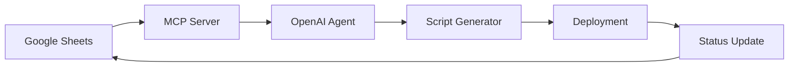

# Automation Agent with OpenAI Agents SDK + MCP

A comprehensive automation system that reads Google Sheets entries and automatically generates and deploys automation scripts using OpenAI Agents SDK with MCP integration.

## 🚀 Features

- **Google Sheets Integration**: Monitor Google Sheets for automation requests
- **Script Generation**: Automatically generate Python scripts for different automation types
- **OpenAI Agents SDK**: Leverage advanced AI capabilities for intelligent automation processing
- **MCP Integration**: Use Model Context Protocol for seamless communication
- **Multiple Automation Types**: Support for file processing, API monitoring, data synchronization, notifications, and reports
- **Comprehensive Error Handling**: Robust error handling with retry logic and circuit breakers
- **Real-time Monitoring**: Continuous monitoring of automation requests
- **Interactive Mode**: Chat interface for manual automation management

## 📋 Supported Automation Types

1. **File Processor**: Monitor directories and process files based on rules
2. **API Monitor**: Monitor APIs and trigger actions on changes
3. **Data Sync**: Synchronize data between systems on schedules
4. **Notification Sender**: Send notifications based on triggers
5. **Report Generator**: Generate and distribute reports automatically

## 🛠 Installation

1. **Clone the repository**:
   ```bash
   git clone <repository-url>
   cd automation-agent
   ```

2. **Install dependencies**:
   ```bash
   pip install -r requirements.txt
   ```

3. **Set up environment variables**:
   ```bash
   cp .env.example .env
   # Edit .env with your configuration
   ```

4. **Configure Google Sheets API**:
   - Create a Google Cloud project
   - Enable Google Sheets API
   - Create a service account
   - Download the JSON key file
   - Set `GOOGLE_APPLICATION_CREDENTIALS` in `.env`

## ⚙️ Configuration

### Environment Variables

Create a `.env` file with the following variables:

```bash
# OpenAI Configuration
OPENAI_API_KEY=your-openai-api-key

# Google Sheets Configuration
GOOGLE_APPLICATION_CREDENTIALS=/path/to/service-account-key.json
GOOGLE_SHEETS_ID=your-google-sheets-id

# Deployment Configuration
AUTOMATION_DEPLOY_PATH=/path/to/automation-scripts
AUTOMATION_LOG_PATH=/var/log/automations

# Security Settings
ENABLE_SCRIPT_SANDBOXING=true
MAX_CONCURRENT_AUTOMATIONS=10
SCRIPT_TIMEOUT_SECONDS=300

# Monitoring
ENABLE_METRICS=true
MONITORING_INTERVAL=30
```

### Google Sheets Setup

Create a Google Sheet with the following column structure:

| Column | Header | Description |
|--------|---------|-------------|
| A | Automation Name | Unique name for the automation |
| B | Automation Type | Type (file_processor, api_monitor, etc.) |
| C | Configuration | JSON configuration parameters |
| D | Status | Current status (pending, processing, deployed, failed) |
| E | Created Date | When the automation was created |
| F | Last Updated | When the status was last updated |
| G | Error Message | Any error messages from processing |

## 🎯 Usage

### 1. Setup and Validation

First, run the setup to validate your configuration:

```bash
python run_agent.py --mode setup
```

### 2. Create Example Sheet (Optional)

Populate your Google Sheet with sample automation configurations:

```bash
python setup_example_sheet.py
```

### 3. Run the Agent

#### Continuous Monitoring Mode
Monitor Google Sheets and process automations automatically:

```bash
python run_agent.py --mode monitor
```

#### Interactive Mode
Chat interface for manual automation management:

```bash
python run_agent.py --mode interactive
```

#### Single Task Mode
Execute a specific task:

```bash
python run_agent.py --mode task --task "Get all pending automations"
```

#### Test Mode
Run system tests to validate functionality:

```bash
python run_agent.py --mode test
```

### 4. Run Tests

Execute the comprehensive test suite:

```bash
python tests.py
```

## 📊 Example Configurations

### File Processor
```json
{
  "type": "file_processor",
  "source_directory": "/path/to/watch",
  "file_patterns": ["*.csv", "*.json"],
  "actions": ["validate", "transform", "archive"],
  "schedule": "*/5 * * * *",
  "output_directory": "/path/to/processed"
}
```

### API Monitor
```json
{
  "type": "api_monitor",
  "endpoint": "https://api.example.com/status",
  "check_interval": 300,
  "trigger_conditions": ["status != 'healthy'"],
  "actions": ["send_alert", "log_incident"],
  "notification_channels": ["email", "slack"]
}
```

### Data Sync
```json
{
  "type": "data_sync",
  "source": {"type": "database", "connection": "postgresql://..."},
  "destination": {"type": "api", "endpoint": "https://api.target.com"},
  "schedule": "0 2 * * *",
  "mapping": {"source_field": "dest_field"},
  "batch_size": 1000
}
```

### Notification Sender
```json
{
  "type": "notification_sender",
  "trigger_conditions": ["error_count > 5", "response_time > 1000"],
  "notification_channels": ["email", "slack", "sms"],
  "message_template": "Alert: {condition} triggered at {timestamp}"
}
```

### Report Generator
```json
{
  "type": "report_generator",
  "report_type": "daily_summary",
  "schedule": "0 8 * * *",
  "recipients": ["team@example.com"],
  "format": "html"
}
```

## 🏗 Architecture

### Components

1. **Google Sheets MCP Server** (`google_sheets_mcp_server.py`)
   - Connects to Google Sheets API
   - Provides MCP tools for reading/writing sheet data
   - Validates automation configurations

2. **OpenAI Automation Agent** (`automation_agent.py`)
   - Uses OpenAI Agents SDK for intelligent processing
   - Communicates with MCP server for sheet operations
   - Generates and deploys automation scripts

3. **Script Generator** (`automation_agent.py:AutomationScriptGenerator`)
   - Templates for each automation type
   - Dynamic script generation based on configuration
   - Security and error handling built-in

4. **Error Handler** (`error_handler.py`)
   - Comprehensive error handling and logging
   - Retry logic with exponential backoff
   - Circuit breaker pattern for external services

### Data Flow



## 🔧 Development

### Adding New Automation Types

1. **Add template** to `AutomationScriptGenerator.SCRIPT_TEMPLATES`
2. **Update validation rules** in `config.py:Config.VALIDATION_RULES`
3. **Add to allowed types** in `config.py:Config.ALLOWED_AUTOMATION_TYPES`
4. **Create example configuration** in `config.py:Config.get_example_configs()`
5. **Add tests** in `tests.py`

### Running Tests

```bash
# Run all tests
python tests.py

# Run system validation
python run_agent.py --mode test

# Test specific functionality
python -c "from tests import test_script_generator; test_script_generator()"
```

### Debugging

Enable debug logging:

```bash
python run_agent.py --mode monitor --log-level DEBUG
```

View logs:

```bash
tail -f /tmp/logs/automations/automation_agent.log
```

## 🔒 Security

- **Script Sandboxing**: Optional sandboxing for generated scripts
- **Input Validation**: Comprehensive validation of all configurations
- **Access Control**: Service account-based authentication for Google Sheets
- **Error Isolation**: Robust error handling prevents system crashes
- **Audit Logging**: Complete audit trail of all operations

## 🚨 Troubleshooting

### Common Issues

1. **Google Sheets Authentication Error**
   ```bash
   # Verify credentials file exists and has correct permissions
   ls -la $GOOGLE_APPLICATION_CREDENTIALS

   # Test Google Sheets access
   python -c "from google_sheets_mcp_server import GoogleSheetsClient; GoogleSheetsClient().read_data('A1:A1')"
   ```

2. **OpenAI API Error**
   ```bash
   # Verify API key is set
   echo $OPENAI_API_KEY

   # Test OpenAI connection
   python -c "import openai; print('Connection OK')"
   ```

3. **MCP Server Connection Error**
   ```bash
   # Test MCP server standalone
   python google_sheets_mcp_server.py
   ```

4. **Script Generation Error**
   ```bash
   # Test script generator
   python -c "from automation_agent import AutomationScriptGenerator; print('Generator OK')"
   ```

### Getting Help

1. Check the logs in `/tmp/logs/automations/`
2. Run system tests: `python run_agent.py --mode test`
3. Enable debug logging: `--log-level DEBUG`
4. Review error messages in Google Sheets error column

## 📈 Monitoring

The system includes built-in monitoring capabilities:

- **Real-time status updates** in Google Sheets
- **Comprehensive logging** with structured log format
- **Error tracking** with automatic retry mechanisms
- **Performance metrics** (if Prometheus is enabled)

## 🤝 Contributing

1. Fork the repository
2. Create a feature branch
3. Add tests for new functionality
4. Ensure all tests pass
5. Submit a pull request

## 📄 License

This project is licensed under the MIT License - see the LICENSE file for details.

## 🙏 Acknowledgments

- OpenAI for the Agents SDK
- Google for the Sheets API
- The MCP community for protocol specifications